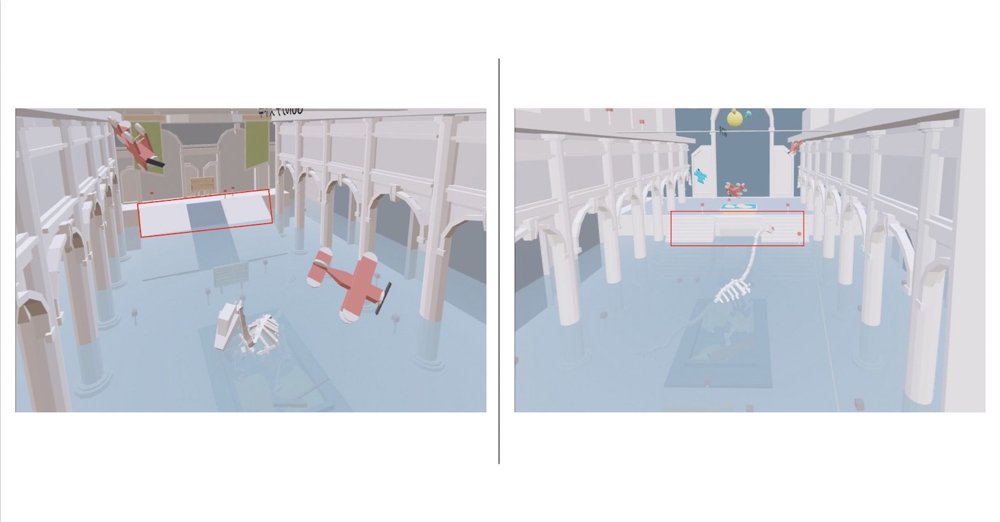
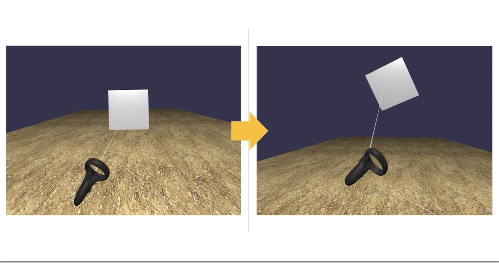

# Babylonjs GUI for Oculus Quest

---

# Feature

Basic functions are added to the repo for BJS and VR beginner like me.

* import mesh 

* enable teleport  

* Grab objects  

* GUI text  (TBA)  

* Scroll  (TBA)

* Scene change (TBA)  


---

# Usage
Set these code in your server or use node.js. 

eg. 

```bash
$ npm init -y
$ npm install --save-dev express 
$ node server.js
```

Access the URL

```html
http://localhost:8001
```

## Import mesh, and teleport

Activate "TeleportCheck.js" in index.html.

```html
<script src="./js/TeleportCheck.js"></script>
```

Hold up on joystick of quest controller. Then teleport circle is showed. Release the joystick, you can teleport.  

Registered mesh by enabledTeleportation is the two red square.  



See : https://doc.babylonjs.com/how_to/webvr_helper

## Grab objects

Activate "GrabObjectsCheck.js" in index.html.

```html
<script src="./js/GrabObjectsCheck.js"></script>
```

Pressing main trigger of left quest controller when ray from the controller hits cube objects.  



See the movie.  

[](https://youtu.be/iop5lj0CoKc)  

The code is based on the playground sample. Thanks for great code!

https://www.babylonjs-playground.com/#5P51YL#5

---

# model

Thanks for great models.


## The Entryway - Museum Diorama  (by Joshua Johanson)
https://poly.google.com/view/9bdkTVw8GE8

